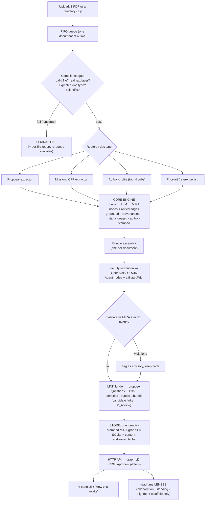
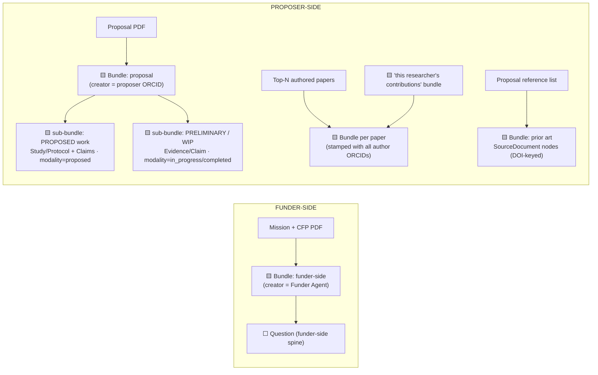
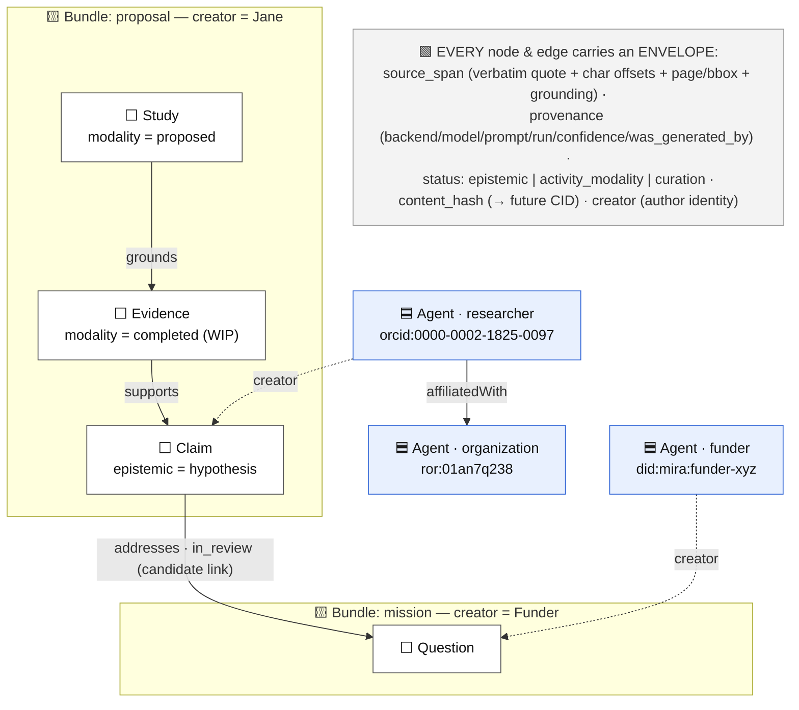
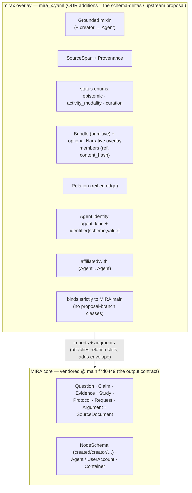
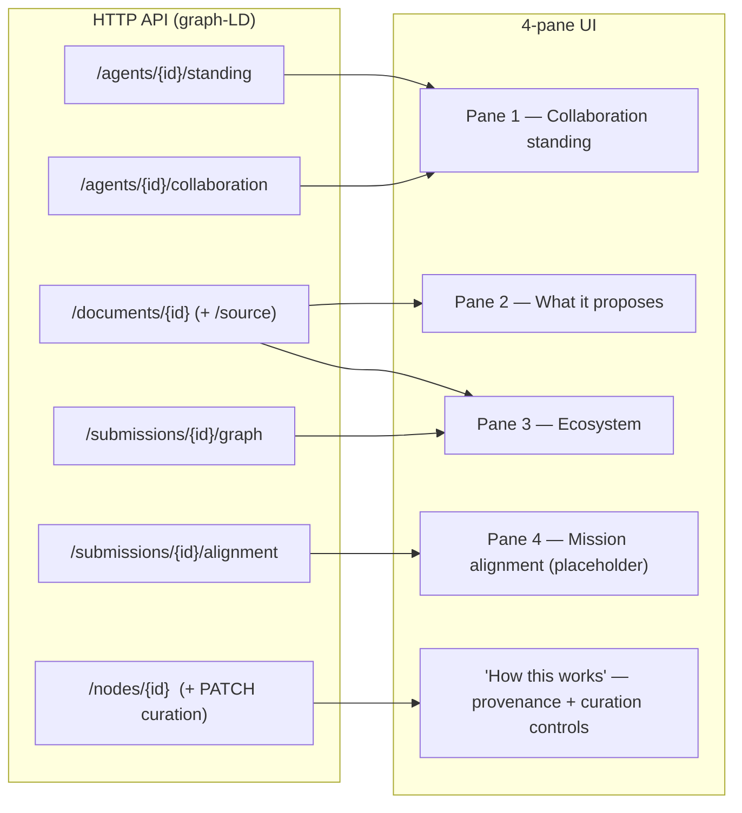
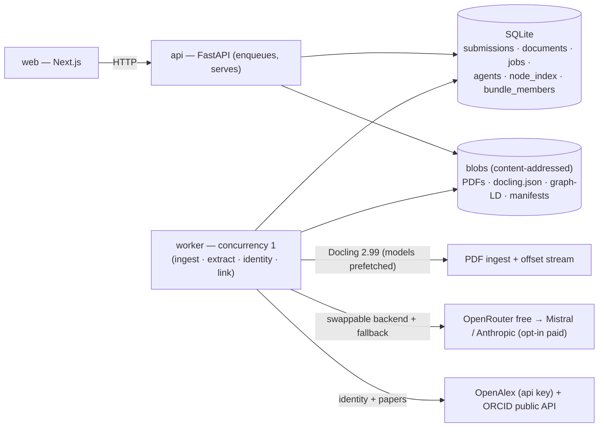
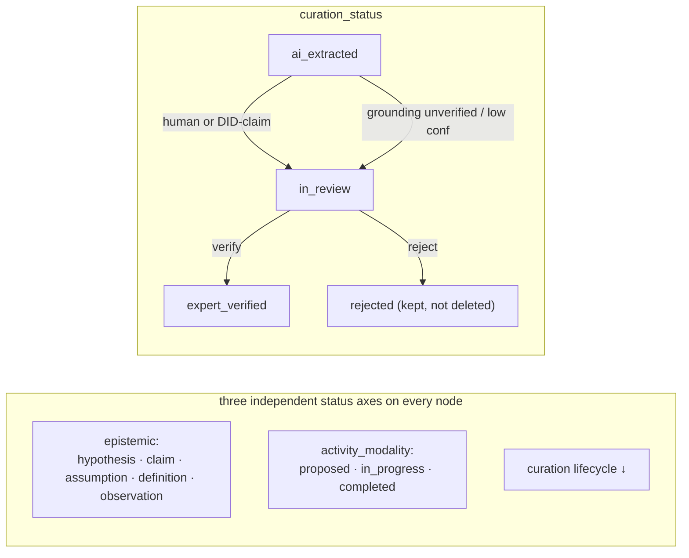

# MIRA-extraction — v1 Visual Model

_Companion to `SPEC.md` v0.3 · 2026-06-09 · for review._

Renders on GitHub, in VS Code (Mermaid preview), or at <https://mermaid.live>. Each diagram has a
one-line caption and a pointer to the SPEC section it depicts.

**Legend (node kinds in the graph diagrams):**
🟦 Agent / identity · ⬜ discourse node · 🟨 Bundle (Narrative = optional overlay) · 🟩 reified Relation (edge-as-node).

---

## 1. Pipeline flow (SPEC §1)

What happens to one uploaded PDF, end to end. One document at a time (FIFO); uncertainty → quarantine.

---

## 2. Each document → a Bundle (SPEC §4.9, §7)

Every doc type explodes into MIRA nodes that **stay grouped** in a **Bundle**. Bundles nest; the
proposal carries proposed-work and WIP as sub-bundles. (A Narrative is an optional prose overlay.)

---

## 3. The one identity-stamped graph (SPEC §4.10, §8, §10) — example instance

Humans/orgs/funders are 🟦 **Agent identities** (never discourse nodes); they **author** ⬜ discourse
nodes (`creator`) and **relate to each other** (`affiliatedWith`). Edges shown as labels are
each a 🟩 reified `Relation` node carrying its own envelope.

---

## 4. Schema layering (SPEC §5)

We **validate against** the pinned MIRA core; everything we add lives in one **overlay** whose diff is
the upstream proposal. Verified: `gen-pydantic` + closed JSON-Schema generate for all classes.

---

## 5. API → 4-pane UI (SPEC §11, §12)

API-first: the UI is one client; lenses are computed read-time. Pane 4 is a placeholder (metric deferred).

---

## 6. Runtime topology (SPEC §2.3)

Three services share SQLite + the blob store; the single worker does all heavy work and calls out to
the LLM and identity sources.

---

## 7. Status axes & the curation lifecycle (SPEC §4.8, §8.4)

The three axes are **independent** (never one score). Curation is the human-in-the-loop path; a future
ATProto "claim" is just a curation event signed by a verifiable DID.

---

_See `SPEC.md` for the authoritative detail and `schema/mira_x.yaml` for the verified overlay._
